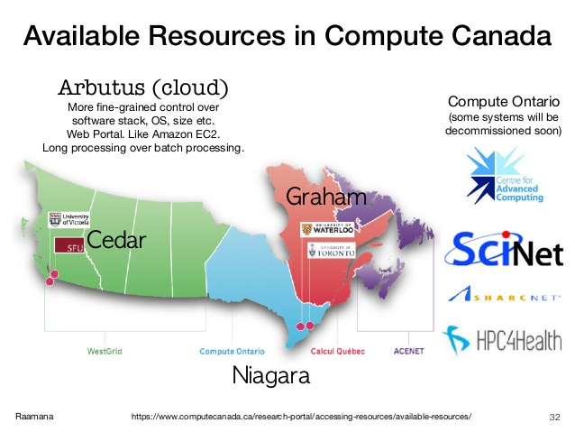
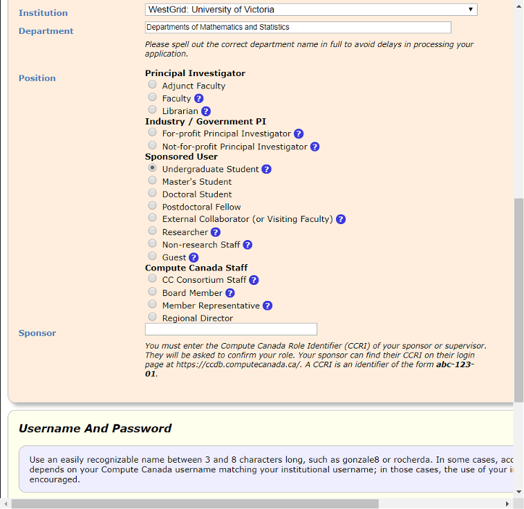
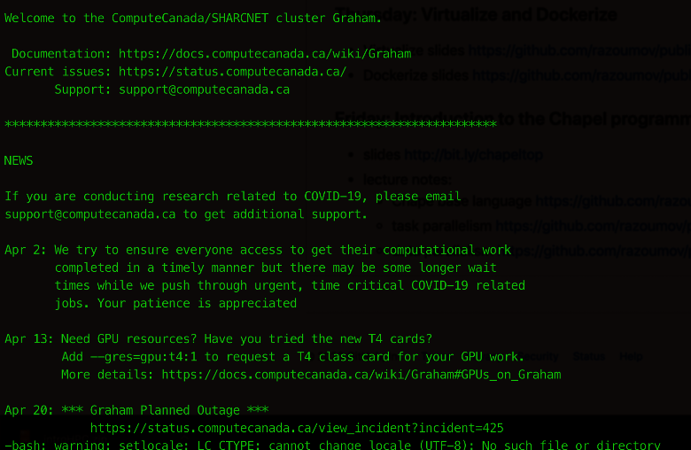
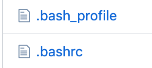
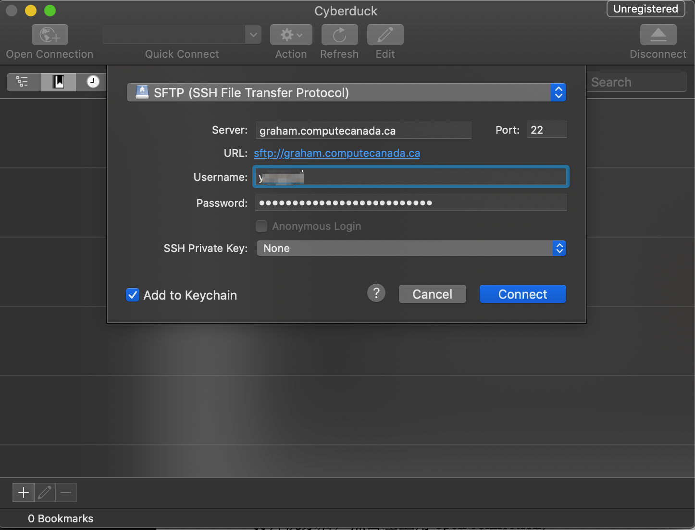
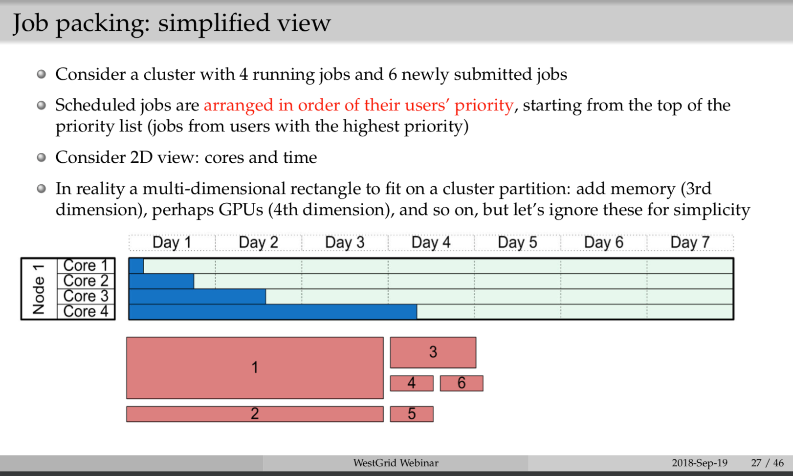
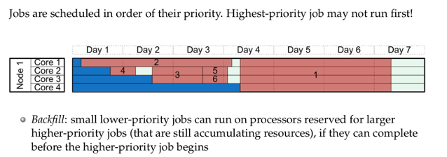

Table of Contents<sup>*</sup>
- [1. Introduction](#1-introduction)
- [2. Account Registration](#2-account-registration)
- [3. Login and Logout of Compute Canada](#3-login-and-logout-of-compute-canada)
    - [3.1 One-time Initialization](#31-one-time-initialization)
- [4. Linux file operation command](#4-linux-file-operation-command)
- [5. Upload and Download](#5-upload-and-download)
    - [5.1 Command line interface](#51-command-line-interface)
    - [5.2 Cyberduck](#52-cyberduck)
- [6. Submitting Jobs](#6-submitting-jobs)
    - [6.1 An Example (and also Vim Usage)](#61-an-example-and-also-vim-usage)
    - [6.2 Submitting Job Script and Job Running](#62-submitting-job-script-and-job-running)

<sub>*: V0.0.1 by Yang (Simon) Guo, based on V0.0.2 of zh-CN document - operating on Compute Canada clusters</sub>

## 1. Introduction

Compute Canada is an advanced research computing (ARC) systems, storage and software solutions. Essentially a cluster computing network across Canada, consisting of multiple regional computing centers (Servers). Many times during research, we will need to use Compute Canada's servers for computing. The distribution of these servers is shown below:



In our group, the usual choices of servers are Cedar at SFU, Graham at Waterloo and Béluga in Montréal.

In comparison, Cedar sometime encounters instability issues, and as of the year 2020, we have Resource Allocation Competitions (RAC) at Graham and Béluga, meaning more resources are allocated to us in those two servers, so I recommend using those two.

The following chapters will briefly introduce operating on clusters and code writing for submitting a sample job.

## 2. Account Registration

After obtaining UVic email address, we can apply for Compute Canada account. Here is the link: [https://ccdb.computecanada.ca/account_application](https://ccdb.computecanada.ca/account_application).

Under `Institution`, follow the below image to fill the blanks, and if you are a master's student, change `Sponsored User` to 'Master's Student'.

For `Sponsor`, enter supervisor's ID: i▇▇▇1.



Above is the user interface for the year 2019, it could appear different now, but should essentially be the same thing. Once you have a Compute Canada account, you can use your username and password to log in Servers (e.g. Cedar, Graham or Béluga).

Now I will start on using the clusters. A much detailed guide can be found at [https://github.com/sgyzetrov/ComputeCanada_Resources/tree/master/RunningJobs](https://github.com/sgyzetrov/ComputeCanada_Resources/tree/master/RunningJobs). It is recommended that you refer to that document for more information after reading this brief guide and to avoid any inaccurate information this document might contain.

## 3. Login and Logout of Compute Canada

We can use command `ssh` to log on to Compute Canada's servers. Under macOS/Linux, open a terminal, and type in the following command to log in Cedar, Graham or Béluga (for Windows users, you can use `MobaXerm` for the following operation):

```sh
ssh username@cedar.computecanada.ca
ssh username@graham.computecanada.ca
ssh username@beluga.computecanada.ca

#username is your own user name, the first command let you log on to Cedar, the second and third one is for Graham and Béluga.
```

Press enter and wait for console to prompt entering password. Then enter your password and press enter again. A few moments later you should see something like this (in Graham, for example):



And if you see something like:


Then you are good to go!

This 'server' that you have logged on to is called `Login Node`, you can check your research data, codes and submit jobs from this server, but please do not run any resource-consuming code on this server, it is not this server's job. Ask compute nodes to run those codes for you (using jobs).


There should be three default folders under your HOME directory: `nearline`, `projects`, and `scratch`. `projects` is normally where we keep our data and codes. `scratch` has more available space to be used temporarily for the same thing but if you do not access it after a period of time, it will empty itself. <u>***Therefore we DO NOT recommend using `scratch` AT ALL***</u>.

Everyone will have their own folder in `projects`, the name will be their username, so the path to that folder will be `~/projects/de▇▇▇/username`.

To log out, just type command `exit` in console and you will be logged out.

### 3.1 One-time Initialization

The first time you logged on to a server, there are some initialization works to perform. This is a one-time thing and you do not have to do this in future login.

We need to put two files (see below) in the current directory, a.k.a `~`, a.k.a `$HOME`:



You can find these files at [https://github.com/sgyzetrov/ComputeCanada_Resources/tree/master/initialization](https://github.com/sgyzetrov/ComputeCanada_Resources/tree/master/initialization).

As for how to get these files on to the server, refer to [section 5](#5-upload-and-download).

## 4. Linux file operation command

Since the OS for Compute Canada servers is Linux (CentOS 7 to be exact), operating it would be the same as a local Linux machine running in [tty1](https://www.ostechnix.com/how-to-switch-between-ttys-without-using-function-keys-in-linux/) (tty1~6 as a matter of fact) mode. Meaning everything is done through command line interface, bye-bye X Window.

Top used Linux commands:

|command   |description   |
|---|---|
|cd   |change directory, e.g. `cd ~/projects/de▇▇▇/username` will enter your personal folder in projects   |
|ls   |list contents of current folder   |
|mkdir   |create folder, e.g. `mkdir data` will create a new folder called 'data' in current directory  |
|rm   |delete file   |
|cp   |copy   |
|mv   |move/rename   |
|...   |...   |

Google for commands' detail usage, also, check out page 11 of [https://github.com/sgyzetrov/ComputeCanada_Resources/tree/master/RunningJobs](https://github.com/sgyzetrov/ComputeCanada_Resources/tree/master/RunningJobs) for other commands.

## 5. Upload and Download

### 5.1 Command line interface

We can use command `scp` for file upload and download.

There are two arguments for `scp` command, when downloading, the first argument is the path on server, the second argument is path on your local machine that you want to download to. In the case of uploading, it is the opposite, where the first argument is the path to your local file for upload, and second argument is where you want to upload the file on server.

Note that both upload and download is not to be executed on server (unless you are trying to upload/download something from/to the server). Otherwise, in the usual case we wish to upload/download something from/to our local machine, and we need to open a new local terminal to execute `scp`.

Suppose we want to upload/download something to/from Graham:

Open a new terminal at local machine and enter the following:

```sh
#download
scp username@graham.computecanada.ca:/home/username/projects/de▇▇▇/username/example.txt ~/PATH/TO/FOLDER/example_folder
#upload
scp ~/PATH/TO/FILE/example.txt username@graham.computecanada.ca:/home/username/projects/de▇▇▇/username/example_folder
```

Other than `scp`, we also have `wget`. `wget` is for when we have data/code that is not on our local machine, or is rather big so we do not want to download to our local machine first then upload to servers. In these cases we can use `wget` to directly download the contents to servers. The simplest way is `wget URL`:

```sh
#First change the directory to the folder where we want to download the data, because wget by default will download to the current path (if you are already in the desired folder, you can skip this step)
cd /PATH/YOU/NEED/FILE/DOWNLOAD/TO

#for example use wget to download testRun.r to current path:
wget https://raw.githubusercontent.com/sgyzetrov/ComputeCanada_Resources/master/Example/ testRun.r
```

Google wget for detail usage.

### 5.2 Cyberduck

We can always use GUI for file uploading and downloading. `Cyberduck` is available for both Mac and PC users. Also I think `MobaXerm` is capable of handling upload/download as well.


Open Cyberduck, click top-left 'open connection', and do the following configuration (using Graham as an example):



Click connect, and you should be all set. Basic operation is the same as navigating in Mac's Finder, you just drag-and-drop the file(s) that you want to upload/download.

Note: a much detailed document on transferring data can be found at [https://docs.computecanada.ca/wiki/Transferring_data](https://docs.computecanada.ca/wiki/Transferring_data) and page 21 of [https://github.com/sgyzetrov/ComputeCanada_Resources/tree/master/RunningJobs](https://github.com/sgyzetrov/ComputeCanada_Resources/tree/master/RunningJobs).

## 6. Submitting Jobs

> On Compute Canada clusters, the job scheduler is the [Slurm Workload Manager](https://en.wikipedia.org/wiki/Slurm_Workload_Manager). Comprehensive [documentation for Slurm](https://slurm.schedmd.com/documentation.html) is maintained by SchedMD. If you are coming to Slurm from PBS/Torque, SGE, LSF, or LoadLeveler, you might find this table of [corresponding commands](https://slurm.schedmd.com/rosetta.pdf) useful.

### 6.1 An Example (and also Vim Usage)

Here I will present a small example on submitting a job. But first, let's talk about `Vim`.

Obviously, the premise of submitting a job is to have the data and code ready. How to upload them to servers has already been introduced earlier. 

While on the servers, for small changes to the code, we can use `Vim`, so that there is no need to repeatedly upload new code to replace older codes for modification purpose.

Although Vim is quite complicated and hard to master, we only need to remember a few key operations for it to work, like how to use Vim to open a document on servers, how to modify, and how to save.

1. Using Vim to open/create a file:

    ```sh
    vim example.r
    ```

2. Modify a file:

    After opening the file / code, hit the keyboard `i` to enter `insert mode`, at this time you can modify the content. To exit `insert mode`, you need to hit the `esc` key on the keyboard.

3. Save a file:

    Saving is very easy. After making the relevant changes, we need to first exit the `insert mode` by pressing the `esc` key, then enter `:`, then `wq` (meaning write + quit) and then press `Enter` key (If you just need to save and not quit, use `:w` and `Enter` instead). 

4. Using Vim to only view the contents then quit:

    After `vim example.r` to view the contents, since we are not in `insert mode`, we can directly use `:q` to quit Vim.

5. Force quit Vim:

    Sometimes we will encounter the situation where we have made unwanted changes to the code and want to exit without saving. In this case we press `esc` and followed by `q!` + `Enter`.

Due to the nature of a cluster, we can easily run the same program multiple times (by submitting multiple jobs), and we can specify the parameters passed to the program at each run. Of course we can also run program in parallel in one job, but it will not be covered in this document. 

Now let's say I want to find [1^1, 1^2, 1^3, 1^4, 1^5], [2^1, ..., 2^5], [...], [10^1, ..., 10^5], and save the results in `rda` files in a folder named `Results`. How to write the R code?

Here is one way to write `testRun.r`:

```r
rm(list=ls(all=TRUE))
time1 <- Sys.time()
print(time1)
args <- commandArgs(trailingOnly = TRUE) # take command argument
seed=as.numeric(args[1]) # passing first argument to seed
#if (length(args)>0) for(i in 1:length(args)) eval(parse(text=args[[i]]))
cat(paste(" Seed =", seed,"\n") ) # Print the random seed 

set.seed(seed)
seedTestArray <- c()
for(i in 1:5){
seedTestArray<-c(seedTestArray, seed^i)
}

# Note: remember to change path!
save(seedTestArray, file=paste0("/home/username/projects/de▇▇▇/username/Results/seedTestRun.",seed,".rda"))
time2<-Sys.time()
print(time2-time1)
q(save="no")
```

Now suppose that we have wrote and uploaded the code, how to get it to Slurm?

We need to write a ShellScript file and submit this file (e.g. `testRun.sh`) to Slurm:

```sh
#!/bin/bash
#SBATCH -J BV1
#SBATCH --account=de▇▇▇
#SBATCH --cpus-per-task=1
#SBATCH --mem=4G # 4GiB of memery
#SBATCH -t 0-00:10 # Running time of 10 min
Rscript --vanilla $HOME/projects/de▇▇▇/username/testRun.r $1 > $HOME/projects/de▇▇▇/username/Rout/testRunOutput.$1.Rout 2>&1
```

Remember to update file path in `.r` and `.sh` files, sample files can be downloaded from [https://github.com/sgyzetrov/ComputeCanada_Resources/tree/master/Example](https://github.com/sgyzetrov/ComputeCanada_Resources/tree/master/Example).

Notice the special format of line 1-6:

- Line 1 indicates using bash to run this script
- `SBATCH -J BV1` name this job as 'BV1'
- `SBATCH --account=de▇▇▇` where `de▇▇▇` is the name of that parent folder in projects, meaning this job is billed to your supervisor. Also, for jobs that require RAC, we will need a different account name, ask supervisor for details.
- `SBATCH --cpus-per-task=1`, 1 CPU per task
- `SBATCH --mem=4G` request 4 GiB memory
- `SBATCH -t 0-00:10` Running time of 10 minutes. So after 10 min, Slurm will kill this job. Also, if you ask too long running time, your job will wait in queue for longer time. <u>**So we recommend estimating running time before, and set this line to slightly more than the estimated time**</u>.
- Line 7 is what is passed to compute nodes. Here it's calling R to run `testRun.r`, and passing one argument. This argument is stored in `$1`. The output of `testRun.r` is stored in files named after `testRunOutput.$1.Rout`. Every time, with different `$1` value, we will have different argument values and different output files.

The above is the basic format of a 'Slurm script'. Notice that we are requesting resources from the cluster, so here involves a very tricky problem: if the CPU is not enough, job runs slowly; if the memory is not enough, the job will be killed due to lack of memory; if the running time is not enough, the job will still be killed. Therefore, it is necessary to estimate the resources required for a job in advance (such as doing small tests locally). Of course, there is also the issue of job scheduling, which usually means that our job will not run immediately after it is submitted. Unless the resources we requested happen to be available in the current system, otherwise this job will enter a queue and follow schedule. 

You can refer to page 27-29 of [https://github.com/sgyzetrov/ComputeCanada_Resources/tree/master/RunningJobs](https://github.com/sgyzetrov/ComputeCanada_Resources/tree/master/RunningJobs), a.k.a the following:




### 6.2 Submitting Job Script and Job Running

After we uploaded `testRun.r` and `testRun.sh`, we can now submit them to Slurm. Since the example in [6.1](#61-an-example-and-also-vim-usage) requires the calculation of 1 to 10 to the power of 1 to 5, we need to pass 1-10 to the code separately. With a simple line of ShellScript code, we can write a loop so that 10 jobs are submitted to Slurm, and each job receives a different user input:

```sh
#enter in cluster's console
for ii in {1..10}; do sbatch testRun.sh $ii; done
```

Here we set up a loop from 1 to 10. `$ii` will therefore be 1 to 10 respectively and passed to `testRun.sh`. In `testRun.sh` it will be passed to `$1`, then to `testRun.r`.

If everything went smoothly, for each `$ii` (from 1 to 10), it should generate 3 types of files in 3 different location. A `.rda` data file in `Results` folder, a `.Rout` file (containing outputs from the R script, e.g. if you used cat(), etc. in your script) in `Rout` folder (Rout folder needs to be created before submitting jobs), and a `slurm-xxxxxx.out` file (containing error information or other slurm job related outputs that are useful for debugging) in the same folder as `testRun.r`. Sometimes `slurm-xxxxxx.out` is just blank so expect that.

For a single job submission, you can for example use `sbatch testRun.sh 2` directly in cluster command line. That is, use the `sbatch` command to pass `testRun.sh 2` to compute node, and compute node will use bash to run `testRun.sh 2`. Value `2` will be passed to `testRun.sh`, and then from `testRun.sh` to `testRun.r`.

Frequent commands for job running:

1. `sbatch `- submitting job
2. `squeue -u yourUsername [-t RUNNING] [-t PENDING]` # list your jobs - check all job status of mine, or check for all pending/running job of mine.
    - Job status code: R = running, PD = pending, CG = completing right now, F = failed
3. `scancel jobID` # cancel a scheduled or running job
4. `scancel -u yourUsername` # cancel all your jobs

A much detailed description and relevant materials can be found at:

1. [https://docs.computecanada.ca/wiki/Running_jobs](https://docs.computecanada.ca/wiki/Running_jobs)
2. [https://github.com/sgyzetrov/ComputeCanada_Resources/tree/master/RunningJobs](https://github.com/sgyzetrov/ComputeCanada_Resources/tree/master/RunningJobs) starting from page 31